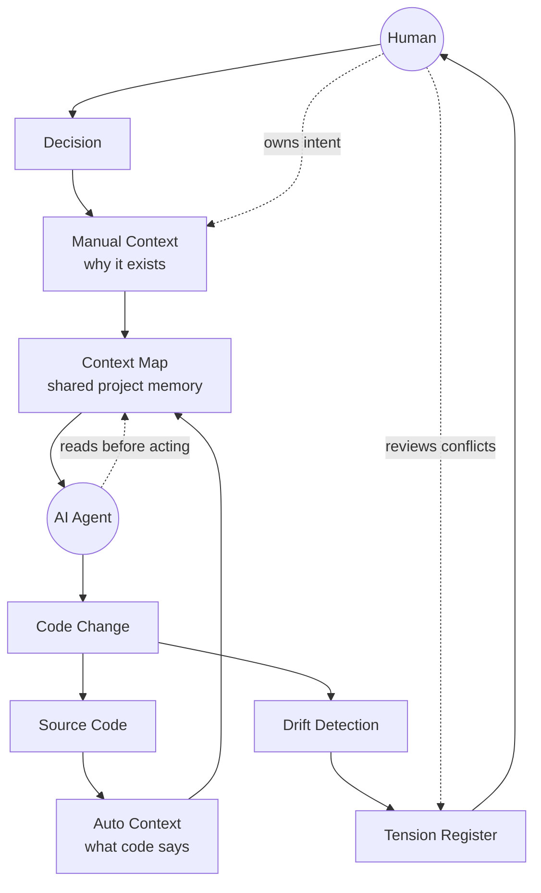

# Conceptual Model

Tài liệu này mô tả `context-gen` ở mức conceptual level: hệ thống này tồn tại để giữ cho source code, ý định thiết kế của con người, và hành động của AI agent cùng vận hành quanh một nguồn context chung.

`context-gen` không chỉ là tool generate documentation. Nó là một cơ chế quản trị context: code nói hệ thống đang làm gì, manual context nói vì sao nó được thiết kế như vậy, còn tension register ghi lại những điểm lệch hoặc xung đột cần con người quyết định.

## Mô hình tổng quan



## Các khối bên trong hệ thống

### Source Code

Source code là trạng thái thực tế của dự án. Nó cho biết module, function, type, import, hook, command, và các boundary kỹ thuật đang tồn tại.

Nhưng source code thường không trả lời đủ các câu hỏi quan trọng hơn:

- Vì sao module này được tách ra?
- Constraint nào không được phá?
- Hành vi nào cố tình chưa implement?
- Khi code thay đổi, manual note nào cần review lại?

Vì vậy source code chỉ là một nửa của context.

### Auto Context

Auto context là phần được sinh từ source code bằng parser. Nó đại diện cho "what code says".

Trong version hiện tại, auto context được tạo từ các parser plugin đã đăng ký trong `schema.REGISTRY`:

- Rust parser
- TypeScript / TSX parser
- PHP / WordPress parser

Auto context nên luôn có thể regenerate. Vì vậy nó không phải nơi để viết decision hay intent. Nếu con người sửa tay phần auto, lần build sau phần đó có thể bị ghi đè.

### Manual Context

Manual context là phần con người sở hữu. Nó đại diện cho "why it exists".

Đây là nơi ghi:

- design decisions
- invariants and constraints
- test strategy
- behavior not yet implemented

Invariant quan trọng nhất của dự án là tool không bao giờ được overwrite manual context. Nếu auto context là trí nhớ về code, manual context là trí nhớ về ý định.

### Context Map

Context map là điểm hợp nhất giữa auto context và manual context.

Nó là tài liệu mà human và agent cùng đọc trước khi hành động. Một context map tốt phải giúp agent hiểu cả hai tầng:

- Code hiện đang có gì?
- Khi sửa code, điều gì phải được giữ nguyên về mặt intent?

Vì vậy context map không phải output phụ. Nó là memory layer của dự án.

### Drift Detection

Drift detection kiểm tra khi auto context thay đổi so với lần build trước. Nếu auto context đổi, manual context có thể vẫn đúng, nhưng cũng có thể đã stale.

Version hiện tại dùng hash trong `AUTO_START` marker để phát hiện việc này:

```text
<!-- AUTO_START | hash: ... | built: ... -->
```

Khi hash mới khác hash cũ, hệ thống hiểu rằng phần code-derived context đã đổi. Nó không tự sửa manual context, vì đó là quyền của human. Thay vào đó, nó tạo tension để review.

### Tension Register

Tension register là nơi ghi lại các điểm cần quyết định hoặc cần review.

Trong V3, tension được tách theo trạng thái:

- `TENSIONS_OPEN.md`: việc đang mở, cần đọc đầy đủ trước mỗi task.
- `TENSIONS_ACTIVE.md`: decision đã resolved nhưng còn active trong milestone hiện tại.
- `TENSIONS_HISTORY.md`: decision cũ đã archive sau milestone transition.

Tension register giúp hệ thống tránh hai lỗi phổ biến:

- Agent tự ý phá constraint vì thấy code nên sửa.
- Human quên rằng một decision cũ vẫn đang ảnh hưởng đến thiết kế hiện tại.

## Human nằm ngoài khối hệ thống

Human không phải một component nội bộ. Human là người sở hữu intent.

Human làm các việc mà tool không nên tự làm:

- quyết định vì sao hệ thống nên đi theo hướng này thay vì hướng khác
- viết hoặc chỉnh manual context
- resolve tension
- approve milestone transition
- cho phép thay đổi scope lớn

Điểm quan trọng: human không cần tự làm mọi thao tác kỹ thuật, nhưng human vẫn là nơi quyết định ý nghĩa của hệ thống.

## Agent nằm ngoài khối hệ thống

AI agent cũng không phải một component nội bộ. Agent là actor sử dụng context map để hành động.

Agent có thể:

- đọc context trước khi sửa
- chạy parser/build/check
- sửa code
- phát hiện tension
- đề xuất implementation

Agent không được tự sở hữu intent. Khi gặp conflict với invariant, agent phải ghi tension hoặc dừng để hỏi human, tùy severity.

## Vòng lặp hoạt động

Một vòng làm việc bình thường diễn ra như sau:

1. Source code được scan để tạo auto context.
2. Manual context cung cấp decisions và constraints.
3. Context map hợp nhất hai phần này.
4. Agent đọc context map trước khi hành động.
5. Agent sửa code hoặc đề xuất thay đổi.
6. Code change làm auto context thay đổi.
7. Drift detection kiểm tra manual context có thể stale không.
8. Nếu có rủi ro stale hoặc conflict, tension register ghi lại.
9. Human review tension và đưa decision.
10. Decision được phản ánh lại vào manual context.

Vòng lặp này giúp dự án không chỉ giữ code chạy được, mà còn giữ ý định thiết kế không bị mất theo thời gian.

## Tóm tắt

`context-gen` có thể được hiểu bằng một câu:

```text
Source code preserves what exists.
Manual context preserves why it exists.
Tension register preserves what still needs human judgment.
```

Tool sinh context, agent dùng context, nhưng human vẫn là người sở hữu decision.
